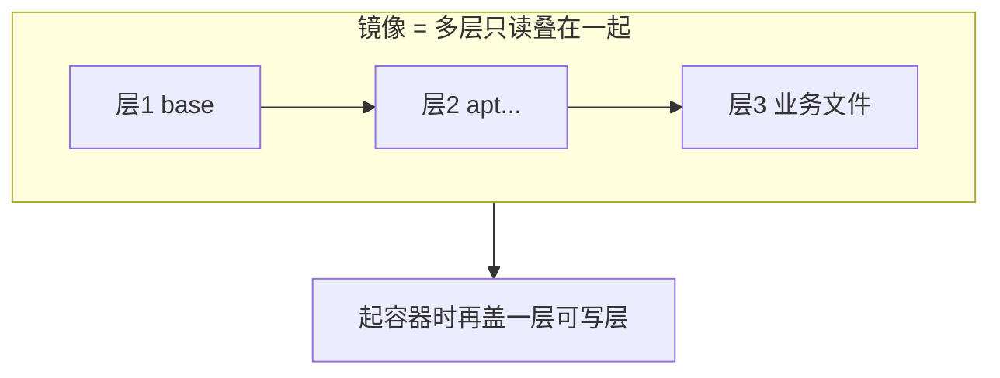

# 镜像 · 分层 · rootfs（够用到内核直觉）

- 维：C1｜挂钩：R1-Q21、ImagePullBackOff 排障
- 约定：先问会不会再讲；未系统维护镜像仓也可懂

> 一面总句：**镜像是只读模板（多层叠起来）；容器 = 镜像只读层 + 一层可写层。** 内核常用 **overlayfs** 把多层合成一个「看起来像完整根目录」的视图。

---

## 1. 先形象：光盘 vs 正在玩的存档

| | 镜像 Image | 容器 Container |
|--|------------|----------------|
| 像什么 | 游戏安装包 / 只读光盘 | 装好后正在玩、能写存档 |
| 变不变 | 内容固定（digest 变了就是另一版） | 运行中可写文件、有进程 |
| 个数 | 一个镜像可起很多容器 | 每个容器一份自己的可写层 |

```text
镜像（只读，可共享）
   │  docker/containerd 「run」
   ▼
容器1 = 共用只读层 + 自己的可写层 A
容器2 = 共用只读层 + 自己的可写层 B
```

所以：**不是一回事**——镜像不跑进程；跑起来的是容器。

---

## 2. 「分层」是什么（构建时）

Dockerfile 每一步常对应一层（简化）：

```text
层3  COPY app /app      ← 最上面
层2  RUN  apt install
层1  FROM ubuntu        ← 最下面（基础）
```

- 每层是一组文件变更（tar / diff）
- 仓库和节点按层的 **digest** 存；相同层可共享，少下重复数据
- **拉取失败**常是某一层下不动/校验失败，不是「整个 iso 一张盘」那么简单



---

## 3. rootfs：容器眼里的「根目录」

**rootfs** ≈ 容器进程看到的 `/`（根文件系统视图）。

它不是随便一个文件夹这么简单，而是：

```text
多个只读层（镜像） + 一层可写层（容器）
        ↓ 内核 overlay 合成
   合并视图 merged = 容器里的 /
```

常用 **overlayfs** 四个角色（名字因实现略异，直觉如下）：

| 角色 | 直觉 |
|------|------|
| **lowerdir** | 下面的只读层（镜像各层） |
| **upperdir** | 容器自己的可写层（新建/修改落这儿） |
| **workdir** | overlay 工作用目录（实现细节） |
| **merged** | 进程真正看到的根 |

**写文件时：**

- 改只读层里已有的文件 → **copy-up** 拷到 upper 再改（写时复制）
- 新文件 → 直接落在 upper
- 删文件 → upper 里记「白出版」（看起来没了，下层只读还在）

```text
读 /etc/hosts：
  先看 upper 有没有 → 没有再穿透到下层镜像

写 /tmp/a：
  写在 upper（可写层）
```

---

## 4. 内核层面支持什么（面试够用）

容器能「每人一个根目录、彼此隔离」，靠的是内核已有能力叠在一起：

| 能力 | 干什么 | 和镜像的关系 |
|------|--------|--------------|
| **namespaces** | pid/mnt/net… 隔离「看见什么」 | mnt ns 里挂上自己的 rootfs |
| **cgroup** | 限制 CPU/内存等 | 不管文件从哪来，管资源 |
| **overlayfs**（或类似联合文件系统） | 多层目录合成一个挂载点 | **分层镜像能高效叠起来的关键** |
| **chroot / pivot_root** | 把进程的根切到 merged | runc 启动时把根换成容器 rootfs |

**没有「容器专用神秘内核模块」一说**——是 namespace + cgroup + 联合文件系统等组合。  
runc 的工作之一：按 OCI 配置，把 overlay 挂好，再 `clone` 进命名空间，启动进程。

```text
containerd：拉层、准备快照（snapshot）、调 runc
runc：用内核能力把 rootfs + ns + cgroup 变成「一个在跑的容器」
```

---

## 5. 和 containerd / 拉镜像的关系（串起来）

```text
镜像仓：存各层 blob + manifest（清单：这个 tag 由哪些层组成）
    ↓ pull
containerd：把层下载到本机 content store，拼成可用快照
    ↓ run
runc：基于快照挂出 rootfs，启动进程
```

排障直觉：

- **ImagePullBackOff**：层还没到齐 / 仓或网络 / 鉴权——还在 containerd 拉层阶段  
- 镜像有了但起不来：更多是 runc、rootfs 挂载、存储满、配置问题  

---

## 6. 30 秒背板

> 镜像是多层只读模板；容器是只读层上再加可写层。rootfs 是合成后的根目录视图，内核用 overlayfs 等联合挂载实现。containerd 负责把层拉下来并准备快照；runc 用 namespace/cgroup/挂载把进程跑进这个根里。

自测：为什么多个容器能共享同一镜像却互不影响写入？
