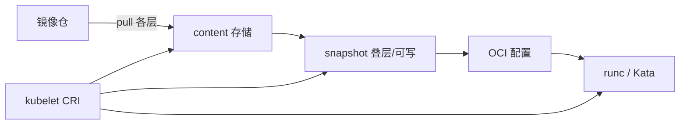

# containerd 在节点上到底干什么

- 维：C1｜挂钩：R1-Q21、镜像分层笔记
- 前置：会「镜像≠容器、分层 + overlay rootfs」

> 一面总句：**containerd 是节点上的容器管家——拉层、存内容、做快照、按 CRI 建沙箱/容器，再把「怎么跑」交给 runc/Kata；它自己通常不直接当业务进程的爹。**

---

## 0. 和上一题自测的衔接

两容器都能写 `/tmp/x` 却互不影响：  
**共享镜像只读层，各有自己的可写层（upper）**；改文件写时复制到自己的 upper，不改镜像。

---

## 1. 它在链路里的位置

```text
kubelet
  │  CRI（gRPC：拉镜像 / 建沙箱 / 起停容器…）
  ▼
containerd          ← 本篇主角
  │  准备好 rootfs 快照 + OCI 配置
  ▼
runc / Kata         ← 真正用内核把进程/VM 拉起来
```

| 角色 | 一句话 |
|------|--------|
| kubelet | 按 Pod 期望下命令 |
| **containerd** | 执行 CRI：管镜像内容与容器生命周期元数据，调下层 runtime |
| runc | 共享内核进程容器 |
| Kata | 轻量 VM 路径 |

---

## 2. 庖丁三块肉（节点上主要管什么）

形象：仓库快递来的是「层零件」；containerd 是车间——收货、入库、组装底板，再交给司机（runc）开车。

### ① Content（内容仓库）

- 下载下来的 **层 blob**、manifest 等按 digest 存  
- 「拉镜像」主要发生在这里：跟镜像仓说话、校验、落盘  

### ② Snapshot / 快照（可启动的文件系统视图）

- 把多层只读层 **叠好**，必要时再加可写层，得到可挂载的 rootfs 材料  
- 和「overlay lower + upper」直觉一致；具体目录由 snapshotter（常是 overlayfs）管理  

### ③ Runtime 调用（交棒）

- 生成 OCI runtime 配置（根路径、namespace、cgroup、挂载…）  
- **调 runc/Kata** 去 `create/start`  
- 自己保持任务元数据，方便 stop/kill/exec/stats  



---

## 3. 对一次「起 Pod」它做了啥（简化）

```text
1. CRI 拉镜像 → 层进入 content（没有则向仓拉）
2. RunPodSandbox → 为 pause/沙箱准备 snapshot + 调 runtime 起沙箱
   （CNI 多在沙箱阶段，由 kubelet/网络插件配合）
3. Create/StartContainer → 再为业务容器准备 snapshot，调 runc/Kata
4. 之后 stop/rm → 收任务、必要时清可写层/快照
```

**它不太负责的（别糊进去）：**

- 调度到哪台节点 → apiserver/scheduler  
- Service VIP / iptables → kube-proxy  
- 写业务代码 → 容器里的进程  

---

## 4. 和 Docker 的关系（一句防面试官绕）

旧链路常有 Docker Engine；现在 K8s 主流是 **kubelet → CRI → containerd**。  
本机还有 `docker` 命令时，也可能下面仍用 containerd，但 **面试以 CRI 链路为准**。

---

## 5. 排障时你「看见」containerd 的方式

| 现象 | containerd 角色 |
|------|----------------|
| ImagePullBackOff | 多半在 **content/拉层**；日志里看仓/网络/鉴权 |
| CreateContainerError | snapshot/配置/runtime 调用失败 |
| 节点上 crictl/ctr | 多在跟 containerd 说话 |

没维护过镜像仓：不必会 Harbor 架构；知道 **仓提供层，containerd 来拉并校验** 即可。

---

## 6. 30 秒背板

> containerd 在节点上接 CRI：把镜像层存进 content，叠成 snapshot，再调 runc 或 Kata 把容器跑起来。业务进程不归它直接 fork 养着，它是管家不是司机。

下一刀可拆：**镜像仓到底存了啥（manifest + blob）**——仍先问会不会。
