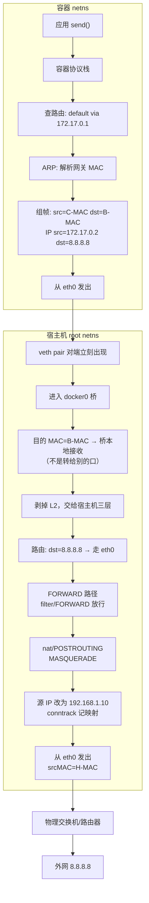
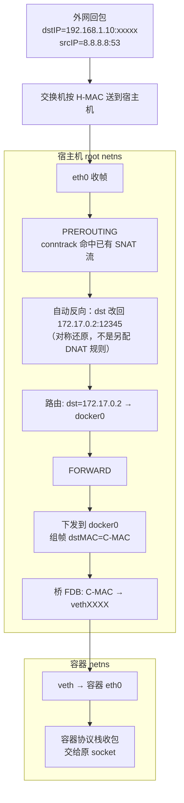
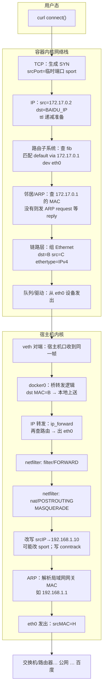
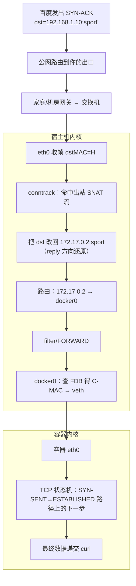

# Docker 默认 bridge：出网/回程逐跳（组件级）

- 维：C1｜挂钩：R1-Q20、`k8s-container-snat-dnat.md`
- 用途：网络特训「讲到毛孔」底稿；面试口述仍用 30 秒版，细节按追问展开

> 场景默认：`docker0` bridge + NAT 出网（Docker 默认）。  
> 数字举例：容器 `172.17.0.2/16`，`docker0=172.17.0.1`，宿主机 `eth0=192.168.1.10/24`，外网 `8.8.8.8`。

---

## 0. 拓扑上有哪些「零件」

```text
┌─ 容器 network namespace ─────────────────────────────┐
│  eth0 (一端 veth)  IP=172.17.0.2  MAC=C-MAC          │
│  路由表：default via 172.17.0.1 dev eth0             │
│  ARP 表：172.17.0.1 → docker0 的 MAC                 │
└───────────────────────────┬─────────────────────────┘
                            │ veth pair（虚拟网线，L2 直通）
┌─ 宿主机 root netns ───────┴─────────────────────────┐
│  vethXXXX (另一端) 挂在 docker0 上，无独立 IP          │
│  docker0 (Linux Bridge)  IP=172.17.0.1 MAC=B-MAC     │
│    · 学习 MAC 表（FDB）：C-MAC ↔ vethXXXX             │
│    · 二层转发；跨网段时当网关交给三层                  │
│  路由表：172.17.0.0/16 → docker0；default → eth0     │
│  netfilter：filter/FORWARD + nat/POSTROUTING 等       │
│  conntrack：连接跟踪表                                │
│  eth0  IP=192.168.1.10 MAC=H-MAC                      │
└─────────────────────────────────────────────────────┘
         │
    物理交换机 / 路由器
         │
       外网
```

| 组件 | 层级 | 干什么 |
|------|------|--------|
| network namespace | 隔离 | 容器有自己的网卡、路由、iptables、ARP；看不见宿主机 `eth0` |
| veth pair | L2 | 像一根网线：一端进容器，一端进宿主机；一端进包另一端出 |
| Linux Bridge `docker0` | L2 交换机 | 学 MAC、同桥口之间转发；自己也可有 IP 当网关 |
| 宿主机路由表 | L3 | 决定「下一跳走哪张网卡」 |
| netfilter / iptables | 钩子 | 在包过协议栈的固定点改地址、过滤 |
| conntrack | 状态 | 记住 NAT 映射，回程自动对称还原 |
| 物理网卡 `eth0` | L2/L3 | 真正接到机房网络 |
| 交换机 | L2 | 只学 **物理网卡 MAC**，不学容器 MAC（默认 bridge） |

---

## 1. 出站：容器访问外网（逐步）

目标：容器发起 `172.17.0.2:12345 → 8.8.8.8:53`（UDP/TCP 同理，下面按 IP 包讲）。

### 总览图



### 步骤细表

| 步 | 位置 | 组件 | 包长什么样 | 原理 |
|----|------|------|------------|------|
| 1 | 容器 | 应用/socket | 用户态数据 | 内核建本地五元组，选临时源端口 |
| 2 | 容器 | 路由表 | 尚未出网卡 | `8.8.8.8` 非直连 → 匹配 `default via 172.17.0.1` → 出口设备 `eth0`，**下一跳网关=docker0** |
| 3 | 容器 | ARP | 可能先发 ARP | 需要网关 MAC：问「谁是 172.17.0.1？」；docker0 在桥上应答 **B-MAC** |
| 4 | 容器 | 以太网帧 | `srcMAC=C-MAC, dstMAC=B-MAC`；IP 仍 `src=172.17.0.2, dst=8.8.8.8` | L2 投递给「网关」，L3 目的仍是外网 |
| 5 | veth | 成对设备 | 帧从容器 eth0 进，对端 vethXXXX **原样**出 | 无 IP 改写；就是跨 namespace 的 L2 管道 |
| 6 | 宿主机 | docker0 | 帧进桥 | 桥查 FDB：目的 MAC 是 **自己的 B-MAC** → 视为发给网关本机，上送三层（不是转给另一容器口） |
| 7 | 宿主机 | IP 转发 | IP 包 `src=172.17.0.2 dst=8.8.8.8` | 开启 `ip_forward`；查路由 → 出口 `eth0`，下一跳是局域网网关（如 `192.168.1.1`） |
| 8 | 宿主机 | filter/FORWARD | 仍未改 IP | Docker 一般在 FORWARD 放行 docker0↔eth0；否则包被丢掉 |
| 9 | 宿主机 | **nat/POSTROUTING + MASQUERADE** | **源改成 192.168.1.10**（端口也可能变） | 出接口已确定为 eth0 后做 SNAT；MASQUERADE=按出接口选源 IP 的 SNAT |
| 10 | 宿主机 | **conntrack** | 表项：`172.17.0.2:12345 ↔ 192.168.1.10:xxxxx` 对 `8.8.8.8:53` | 之后所有同连接包（去/回）靠这张表对称改写 |
| 11 | 宿主机 | eth0 | `srcMAC=H-MAC, dstMAC=交换机/路由器MAC`；IP `src=192.168.1.10 dst=8.8.8.8` | 物理网只看见宿主机 |
| 12 | 机房 | 交换机 | 学到 H-MAC 在某端口 | **学不到 C-MAC**（C-MAC 从未出现在 eth0 上） |
| 13 | 外网 | 服务器 | 看见客户端是 `192.168.1.10` | 回包目的自然是宿主机 IP |

**为何必须第 9 步：** 若跳过 SNAT，外网看到源=`172.17.0.2`，回包目的=`172.17.0.2`；公网/上游无此路由 → 回程不可达。  
（同物理网段可路由方案见 §4，那是另一套组件。）

---

## 2. 回程：外网回到容器（逐步）



| 步 | 组件 | 关键变化 | 原理 |
|----|------|---------|------|
| 1 | 交换机 | 帧到宿主机口 | 目的 MAC 是 H-MAC |
| 2 | eth0 / PREROUTING | 仍先看到 dst=`192.168.1.10` | 包是「打给这台机器的」 |
| 3 | **conntrack** | dst 变为 `172.17.0.2:12345` | 查到出站时的 SNAT 记录，做 **reply direction 还原**；口语别叫「再配一条 DNAT」 |
| 4 | 路由 | 出口 docker0 | `172.17.0.0/16` 直连路由 |
| 5 | FORWARD | 转发进桥 | 不是 INPUT 给宿主本地进程（目的已是容器） |
| 6 | docker0 + FDB | 从 vethXXXX 送出 | 桥按 C-MAC 找到口 |
| 7 | veth | 进容器 eth0 | L2 管道 |
| 8 | 容器栈 | 匹配原连接 | 应用读到响应 |

---

## 3. netfilter 钩子（这题最容易糊的地方）

出站（宿主机转发路径）简化：

```text
容器 → … → 进入宿主机三层转发
  → filter/FORWARD（许不许过）
  → 路由已决定出接口
  → nat/POSTROUTING（在这里 SNAT/MASQUERADE）  ← 改源
  → eth0 发出
```

回程：

```text
eth0 收入
  → raw/PREROUTING / conntrack 关联
  → nat/PREROUTING（若有真正的 DNAT 规则会在这；纯出网回程通常靠 conntrack 已还原）
  → 路由
  → filter/FORWARD
  → … → docker0 → 容器
```

| 名词 | 改什么 | 本场景 |
|------|--------|--------|
| SNAT / MASQUERADE | 源地址 | 出网 POSTROUTING |
| DNAT | 目的地址 | `-p` 映射、K8s Service；**不是**「出网回程的标准叫法」 |
| conntrack 反向 | 按会话对称改 | 出网回程靠它把 dst 改回容器 |

---

## 4. 「容器 IP 和物理机同一网段」时组件差在哪

| | 默认 docker0 + NAT | 同网段且正确接入（例：macvlan） |
|--|-------------------|--------------------------------|
| 容器 IP | `172.17.0.x` 仅桥内 | `192.168.1.50` 与局域网同 CIDR |
| 出口设备 | 仍经 docker0，再转发 eth0 | 往往 **macvlan 子接口** 直接挂物理网 |
| 容器 MAC 是否上物理交换机 | **否** | macvlan：**是**（交换机可学到） |
| 出网是否 SNAT | **要** | 常 **不要**（源已是可 ARP/可路由地址） |
| 回包目的 | 宿主机 IP → conntrack 还原 | **直接是容器 IP** → 二层送到容器 MAC |

默认 bridge **不能**靠「把容器 IP 改成 192.168.1.x」自动变成右栏：缺的是 **在物理网上宣告该 IP/MAC 的组件**（macvlan/路由/proxy ARP 等），不是改个数字。

---

## 5. 面试一般考到哪一层（先看这个）

国内容器/运维/运维开发一面，**网络出网**多数停在下表「够用」档；再深是加分或二面抠细节。

| 深度 | 你要能说清什么 | 是否常见 |
|------|----------------|----------|
| **L0 结论** | 出网 SNAT 改源；回程靠 conntrack；有去有回 | **必考口径** |
| **L1 路径** | 容器 → veth → docker0 → 宿主机转发 → MASQUERADE → eth0 → 外网；回程对称 | **高频** |
| **L2 组件** | netns 隔离；桥当网关；`ip_forward`；物理网只见宿主 MAC | 运维开发向 **常追** |
| **L3 内核点名** | ARP 解析网关；POSTROUTING 做 SNAT；conntrack 表项；FORWARD 不是 INPUT | **加分**；能点名钩子更好 |
| **L4 毛孔** | 每跳 MAC/IP 字段变化；DNS/TCP 握手各自走一遍 NAT；checksum、邻居子系统 | **很少首问**；你主动讲太细反而像背书，等追问再展开 |
| **L5 旁路** | skb、qdisc、软中断、GRO/TSO、桥的 netfilter 调用约定 | **几乎不考**（偏内核岗） |

**训练建议：** 先练到 **L1 口述流畅 + L2 能答追问**；L3 作为「面试官再问一句」的储备；本篇后面的「访问百度」是 L3～L4 自学底稿，不是一面默认背诵全文。

---

## 6. 简单流程（先建立电影长镜头）

容器里：`curl https://www.baidu.com`

```text
① DNS（若需要）查出百度 IP
② TCP 三次握手连上 443
③ TLS + HTTP 请求
④ 对端响应回来
⑤ 连接拆除（可选细节）

每一小步里的「IP 包」，出容器后都走同一条数据面：
  容器栈 → veth → docker0 → 宿主机三层转发 → SNAT → eth0 → … → 百度
  回程：… → eth0 → conntrack 还原 → docker0 → veth → 容器栈
```

下面 §7 把「一个 TCP 数据包」拆开；DNS/握手只是**多次**走这条路。

---

## 7. 访问百度：从发起到回包（按时间线）

约定：
- 容器 `172.17.0.2`，`docker0=172.17.0.1`（MAC=`B`），宿主 `eth0=192.168.1.10`（MAC=`H`）
- 容器 DNS 常是 `127.0.0.11`（Docker embedded DNS）或宿主给的 DNS；下面分两岔说明
- 百度解析结果记为 `BAIDU_IP`（真实有多个 A 记录，原理一样）

### 7.1 应用层发生了什么（内核之上）

| 顺序 | 谁 | 做什么 |
|------|-----|--------|
| A | `curl` | `getaddrinfo("www.baidu.com")` → 可能触发 DNS |
| B | | `socket()` + `connect(BAIDU_IP, 443)` → 内核发 SYN |
| C | | TLS 握手、HTTP GET（都是已建立连接上的 payload） |
| D | 对端 | SYN-ACK、ACK、TLS、HTTP 响应 —— 每个都是回程 IP 包 |

### 7.2 DNS 包怎么走（两种常见）

**岔路 D1：Docker 默认 embedded DNS（`nameserver 127.0.0.11`）**

```text
容器 → 127.0.0.11:53
  · 目的是 loopback，不进 docker0，不进宿主机转发，不做出网 SNAT
  · dockerd 在用户态代理 DNS，再由【宿主机侧】向外网 DNS 查询
  · 对外那一跳：源已是宿主机（或 docker 代发），不是容器 172.17.0.2 直接出网
```

面试一句：`127.0.0.11` 是 Docker 的 DNS 代理，**容器到 127.0.0.11 不算「容器 IP 出网」**。

**岔路 D2：容器直接把公共 DNS 写成 `8.8.8.8`（更适合讲清 SNAT）**

DNS 查询包与下面「数据包」走**同一条** bridge+SNAT 路径（UDP/53）。

### 7.3 一个出站 TCP 段（以 SYN 为例）——内核里逐步



**字段变化（出站 SYN，简化）：**

| 阶段 | src IP | dst IP | src MAC | dst MAC |
|------|--------|--------|---------|---------|
| 刚出容器 eth0 | 172.17.0.2 | BAIDU_IP | C | B（docker0） |
| 过 veth 后（进桥前） | 同左 | 同左 | 同左 | 同左 |
| SNAT 之后、出 eth0 | **192.168.1.10** | BAIDU_IP | **H** | 网关 MAC |
| 公网上 | 192.168.1.10（或再经运营商 NAT） | BAIDU_IP | （逐跳改写） | （逐跳改写） |

说明：家里/公司若还有上层 NAT，公网看到的可能是运营商地址；**容器场景面试焦点仍是「节点上这一次 MASQUERADE」**。

### 7.4 ARP 单独说清楚（两处 ARP，别混）

| 哪里 | 谁问谁 | 为什么 |
|------|--------|--------|
| **容器内** | 「`172.17.0.1` 的 MAC？」 | 默认路由下一跳是 docker0，同网段用 ARP |
| **宿主机上** | 「`192.168.1.1`（局域网网关）的 MAC？」 | 包要从 eth0 出局域网，下一跳是路由器 |

容器 **不会** ARP「百度的 MAC」——百度不在二层可达范围；只 ARP **默认网关**。

### 7.5 回包（以 SYN-ACK 为例）——对称



之后的 ACK、TLS、HTTP 请求/响应：**同一条五元组**，重复「出站 SNAT / 回程还原」，只是 TCP 序号和 payload 不同。

### 7.6 和「内核」相关的面试够用清单

要能点名即可，不必背函数名：

1. **路由（FIB）**：决定出哪个设备、下一跳是谁  
2. **邻居子系统（ARP）**：把下一跳 IP 变成 MAC  
3. **网桥**：按 MAC 转发或上送本机  
4. **netfilter 钩子**：FORWARD 过滤；POSTROUTING NAT  
5. **conntrack**：NAT 有状态，回程自动改回来  
6. **TCP 状态机**：在**容器（或发起 connect 的那个 netns）**里跑，不在 docker0 里

### 7.7 一张「访问百度」总时间线（口述用）

```text
curl 百度
  ├─ [可选] DNS
  │    └─ 若走 8.8.8.8：UDP 包整条 bridge+SNAT；若走 127.0.0.11：容器内环回+dockerd 代理
  ├─ TCP SYN（出站全路径 + SNAT）
  ├─ SYN-ACK（回程 conntrack 还原）
  ├─ ACK
  ├─ TLS / HTTP 请求（多包，同一路径）
  └─ HTTP 响应（多包回程）
```

**一面推荐口述长度：** 总时间线 + SNAT/conntrack + veth/docker0/eth0；ARP 提「容器只 ARP 网关」一句足够。  
等面试官问「那 ARP 问的是谁」「回程是不是 DNAT」再展开 §7.3～7.5。
