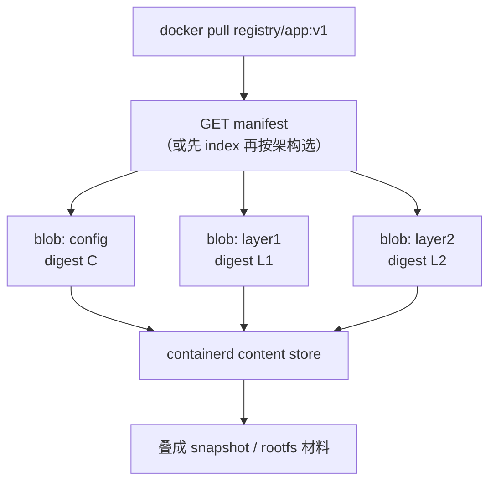

# 镜像仓够用级：manifest · digest · blob

- 维：C1｜挂钩：分层/rootfs、containerd、ImagePullBackOff
- 学员起点：知 manifest≈说明堆哪些层；digest≈层编号（本篇纠偏加深）

> 一面总句：**Tag 指向一份 manifest；manifest 列出配置 + 各层的 digest；仓里按 digest 存 blob。拉镜像 = 先拿清单再按编号取层。**

---

## 1. 先纠偏你的两句话

| 你的说法 | 更准一点 |
|----------|----------|
| manifest 说明哪些**层（目录）**堆叠 | 说明哪些 **层 blob**（多为压缩的文件系统差分包）+ **config**；仓库里不是直接存「目录树」给人浏览 |
| digest 是编号 | 是内容的 **哈希**（常见 `sha256:…`）：内容变，digest 必变；同内容同 digest，可共享去重 |

```text
tag:  app:v1          ← 人类可读的指针（可变：今天指 A，明天可改指 B）
         ↓
manifest / index      ← 清单：这个「版本」由哪些 digest 组成
         ↓
blobs                 ← 真正的字节：config + layer1 + layer2 …
各用 digest 当地址
```

---

## 2. 仓里主要三样东西（形象）

把仓库想成图书馆：

| 东西 | 形象 | 作用 |
|------|------|------|
| **Tag** | 书架上的书名条「最新版」 | 好记；可能被挪到另一本 |
| **Manifest** | 这本书的**目录页** | 列出需要哪些章节（层）的编号 |
| **Blob（含各层）** | 按编号锁在库房的**书册本体** | 真正下载的数据；按 digest 取 |

多层架构还会有 **manifest list / index**（一页目录指向 amd64/arm64 各自的 manifest）。面试知「多架构时先选平台再取对应清单」即可。



---

## 3. 拉取时双方在干什么

```text
1. 客户端（containerd）问仓：tag v1 的 manifest 是谁？
2. 仓返回 manifest（JSON）：config 的 digest + 各 layer 的 digest
3. 对每个还没有的 digest：按地址下载 blob，校验哈希
4. 本地 content 齐了 → 再 snapshot → 才能给 runc 用
```

**和排障的关系：**

| 事件里常见 | 更可能卡在 |
|------------|------------|
| not found | tag/manifest 或某层在仓里没有 |
| unauthorized | 鉴权/Secret 拿不到清单或层 |
| timeout / connection | 节点到仓的网络 |
| 校验失败 | 下到的 blob 和 digest 对不上（损或传错） |

仍不必会搭 Harbor；知道 **仓 = 清单服务 + 按 digest 的 blob 存储** 即可。

---

## 4. 和「分层 / containerd」串成一条

```text
仓：manifest + blobs（digest）
  → containerd content：把 blob 落到节点
  → snapshot：按 manifest 顺序叠层 + 可写层
  → runc：挂出 rootfs，起进程
```

---

## 5. 30 秒背板

> Tag 好记但可变；真正锁定内容的是 digest。Manifest 是清单，写出 config 和各层 digest；仓按 digest 存 blob。拉镜像先取清单再取层，containerd 收齐后才能叠成可用 rootfs。

自测：为什么生产常说「用 digest 部署比只用 latest 更稳」？
