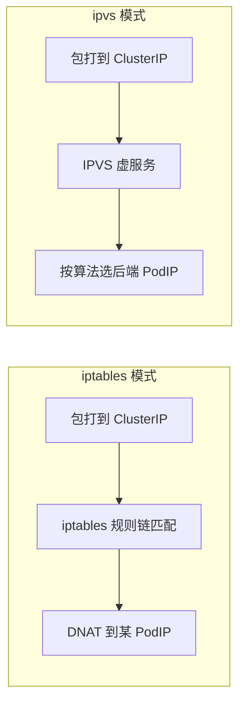

# kube-proxy：iptables vs ipvs（一面对比）

- 维：C1｜题：R1-Q18（挂钩 R1-Q04/Q11）｜状态：半会（2026-07-30 四句过关）

> 一面总句：**kube-proxy 主要在各节点维护转发规则，不是业务流量的 HTTP 下一跳。**  
> **iptables 与 ipvs 的包转发都在内核完成**；差别是 netfilter 规则链 vs IPVS 负载均衡子系统。  
> Service 多了常更倾向谈 ipvs。

---

## 0. 先钉死共同前提

```text
客户端 → 目的 ClusterIP:port
       → 本节点「内核里的转发」（netfilter/iptables 或 IPVS）
       → 改写到某个 Ready PodIP:targetPort
用户态 kube-proxy：只负责把规则/虚服务同步进内核，一般不经它转发业务包
```

| 错觉 | 正解 |
|------|------|
| 包先进入 kube-proxy 进程再转发 | 一般否；kube-proxy 是**规则管理员（用户态）** |
| 只有 ipvs 才是内核转发，iptables 不是 | **都是内核数据面**：iptables 模式走 **netfilter**；ipvs 模式走 **IPVS 子系统** |
| iptables/ipvs 决定有没有后端 | 否；后端名单来自 **Endpoints**；模式只决定**怎么转** |

---

## 1. 两模式对比

| | **iptables** | **ipvs** |
|--|--------------|----------|
| 直觉 | netfilter **规则链**匹配 + DNAT | 内核 **IPVS** 虚服务 + 后端 |
| 是否内核转发 | **是**（netfilter） | **是**（IPVS） |
| 优点 | 常见默认、好理解、小中规模够用 | 大规模 Service/规则更新更稳、调度算法可选 |
| 痛点 | Service/Endpoints 多 → 规则多 → **更新/匹配成本上去** | 依赖 ipvs 模块；排障工具略不同 |
| 一面选型 | 默认集群很常见 | Service 爆炸时「倾向讨论」 |



---

## 2. 控制面怎么喂数据面

```text
Service + selector
  → Endpoints / EndpointSlice（Ready Pod 名单）
  → kube-proxy 盯着变
  → 重写本机 iptables 或 ipvs 规则
```

扩缩容：ClusterIP 不变；变的是名单和规则。

---

## 3. 何时提 ipvs（面试口径）

- 小中规模、托管默认 iptables：**说「常见够用」即可**  
- Service 数量很大、规则变更频繁、或团队已有 ipvs 实践：**可以说倾向 ipvs**  
- 托管集群：以平台默认/文档为准，**不要假装自己改过模式**

---

## 4. 排障时怎么确认模式 + 先查什么

确认模式（有权限时）：
- 看 kube-proxy 配置 / ConfigMap（`mode: iptables|ipvs`）
- 或节点上现象：`iptables` 规则 vs `ipvsadm` 虚服务  
- 无权限：诚实说「看平台文档/问平台同学」

**Endpoints 为空时：**  
两种模式都会变成「有 VIP/入口，没有可转后端」。  
**先查：** `kubectl get endpoints/endpointslice`、selector、readiness、port/targetPort——**不是先纠结 iptables 还是 ipvs**。

---

## 5. 30 秒背板

> kube-proxy 装规则，不拦业务 HTTP。  
> iptables 用规则链 DNAT，规模大时更新重；ipvs 是内核 LB，大规模更常被提到。  
> 不通先看 Endpoints 有没有后端，再谈转发模式。

自测：
1. 流量要不要先进 kube-proxy 进程？  
2. 什么时候提 ipvs？  
3. EP 为空时先查什么？
