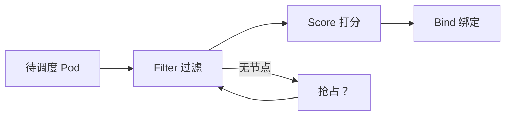

# Scheduler：Filter / Score / 抢占（研发向加深）

- 维：C1｜题：R1-Q23｜挂钩：R1-Q14、混部故事、脉脉调度 JD 2026-08-05
- 深度：一面能串框架；二面可追抢占/优先级；不要求读过调度器源码

> 总句：**调度 = 在可行节点里挑一个「较好」的；先过滤（Filter）再打分（Score）；资源不够时可能抢占（Preempt）。** 污点/亲和是过滤与打分里的规则，不是调度的全部。

---

## 1. 主流程（形象）

```text
Pod 待调度
  → 过滤 Filter：删掉不行的节点（污点不容忍、资源不够、亲和不满足…）
  → 打分 Score：剩下的节点打分（资源富余、亲和加分…）
  → 选最高分（或抽样）绑定 Node
  →（可选）Premption：没有可行节点时，看能否赶走低优先级 Pod
```



---

## 2. 和 Q14 的关系

| Q14 焦点 | Q23 焦点 |
|----------|----------|
| 污点 / 容忍 / 亲和 **规则本身** | 这些规则落在 **Filter/Score 哪一段** |
| 调度「约束」 | 调度「框架 + 优先级/抢占直觉」 |

混部岗常追：在线高优先级、离线低优先级 → **抢占/驱逐/水位** 与 QoS、cgroup 如何配合（细节放 FZ5，此处先有框架）。

---

## 3. 对比表

| 阶段 | 问题 | 例子 |
|------|------|------|
| Filter | 能不能上？ | CPU 不够、NoSchedule 污点、节点选择器不匹配 |
| Score | 谁更好？ | 散开部署、资源剩余多、亲和加分 |
| Preempt | 能不能挤掉别人？ | 高优先级挤低优先级（视配置与版本行为） |

---

## 4. JD 生态一句话（加分，不深挖）

| 项目 | 定位（面试一句） |
|------|------------------|
| Koordinator | 混部/QoS 调度增强（与在离线同构） |
| Volcano | 批处理/队列/作业级调度（训推常见） |
| OpenKruise | 增强工作负载与发布能力 |

未用过：说「知道解决哪类问题」即可，不编落地。

---

## 5. 30 秒背板

> 调度先 Filter 再 Score 再 Bind；污点亲和是规则插件。资源争用要谈优先级与抢占/混部策略。没写过调度器就讲框架 + 生产约束，不装源码贡献。

自测：节点资源够但有 NoSchedule 污点且 Pod 无容忍——死在 Filter 还是 Score？
