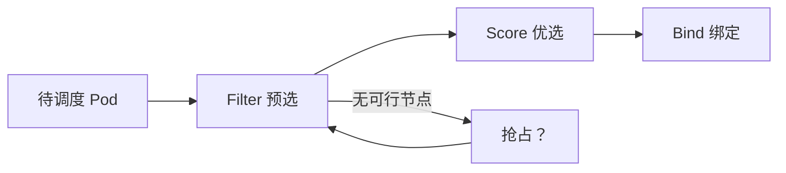

# Scheduler：Filter / Score / 抢占（研发向加深）

- 维：C1｜题：R1-Q23｜挂钩：R1-Q14、混部故事、脉脉调度 JD 2026-08-05
- 深度：一面能串框架；二面可追抢占/优先级；不要求读过调度器源码
- 状态：**2026-08-07 开练**——学员记得「预选/优选」，做过**打分扩展**；框架名 Filter/Score/抢占需回炉口述

> 总句：**调度 = 在可行节点里挑一个「较好」的；先过滤（Filter）再打分（Score）；资源不够时可能抢占（Preempt）。** 污点/亲和是过滤与打分里的规则，不是调度的全部。

**旧名对照（国内常考）：** 预选 ≈ **Filter**；优选 ≈ **Score**。你做过的调度扩展打分 = Score 插件侧。

---

## 1. 主流程（形象）

```text
Pod 待调度（Pending，无 nodeName）
  → Filter（预选）：删掉不行的节点
  → Score（优选）：剩下的打分，挑高分
  → Bind：把结果写回（绑定到 Node）
  →（可选）Preemption：Filter 后一个可行节点都没有时，看能否赶走低优先级 Pod 再试
```



---

## 2. 和 Q14 / 你经历的关系

| Q14 焦点 | Q23 焦点 | 你的经历 |
|----------|----------|----------|
| 污点 / 容忍 / 亲和 **规则本身** | 这些规则落在 **Filter/Score 哪一段** | — |
| — | Score 插件打分选优 | **做过调度扩展打分** → 面试挂这里 |
| 调度「约束」 | 框架 + 优先级/抢占直觉 | 未系统口述抢占则先现象级 |

| 规则类型 | 多落在 |
|----------|--------|
| 硬约束：NoSchedule 污点无容忍、required 亲和、资源 requests 不够 | **Filter**（直接淘汰） |
| 软偏好：preferred 亲和、打散、剩余资源多 | **Score**（加分选优） |

混部岗常追：在线高优先级、离线低优先级 → **抢占/驱逐/水位** 与 QoS（细节 Q24 / FZ5）。

---

## 3. 对比表

| 阶段 | 问题 | 例子 |
|------|------|------|
| Filter（预选） | 能不能上？ | CPU requests 不够、NoSchedule 无容忍、节点选择器不匹配 |
| Score（优选） | 谁更好？ | 散开、资源剩余多、亲和加分——**你的扩展多在这** |
| Preempt（抢占） | 能不能挤掉别人？ | 高优先级 Pod 调度不上时，可能删低优腾地方 |
| Bind | 结果落盘 | 写入绑定，之后才是 kubelet 真正拉起 |

**别糊：** 抢占 ≈ **调度器**在调度阶段腾节点；驱逐 ≈ **kubelet** 节点压力踢 Pod；QoS ≈ requests/limits **推导的档位**（详 Q24）。

---

## 4. JD 生态一句话（加分，不深挖）

| 项目 | 定位（面试一句） |
|------|------------------|
| Koordinator | 混部/QoS 调度增强（与在离线同构） |
| Volcano | 批处理/队列/作业级调度（训推常见） |
| OpenKruise | 增强工作负载与发布能力 |

未用过：说「知道解决哪类问题」即可，不编落地。

---

## 5. 30 秒背板

> 预选 Filter 淘汰不行的，优选 Score 挑较好的，再 Bind；我做过打分扩展就是 Score 侧。资源争用谈优先级与抢占，别和 kubelet 驱逐、QoS 混谈。

自测：节点资源够但有 NoSchedule 污点且 Pod 无容忍——死在 Filter 还是 Score？
