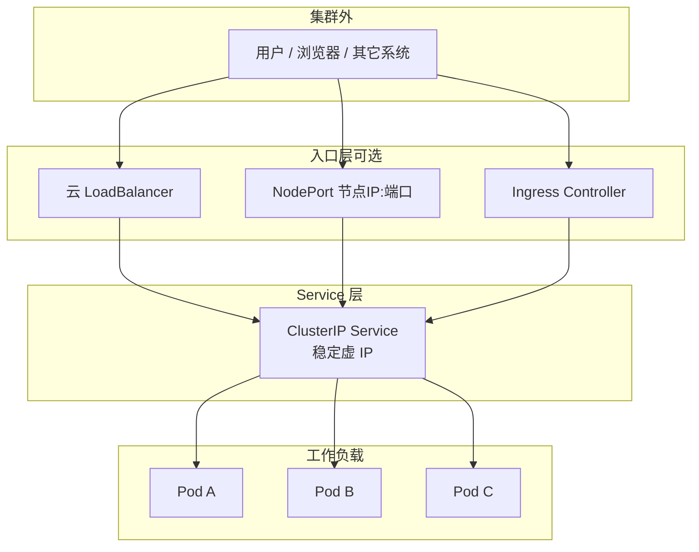
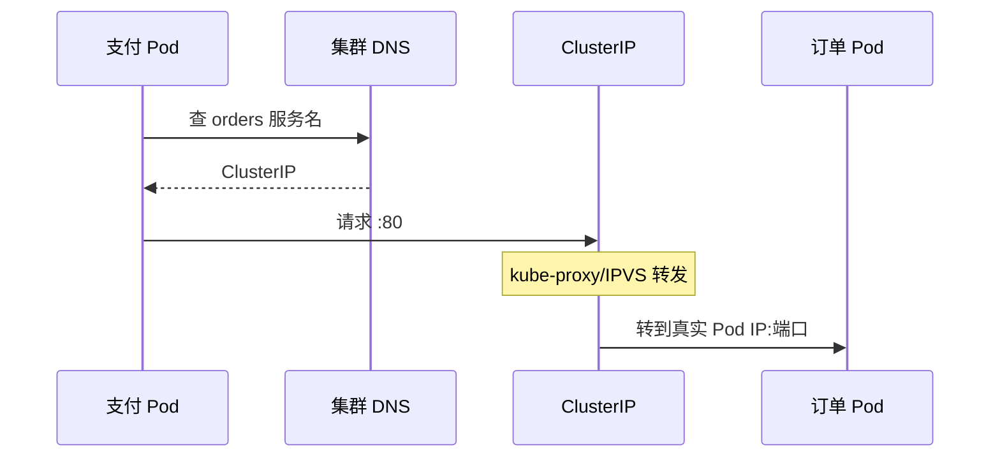
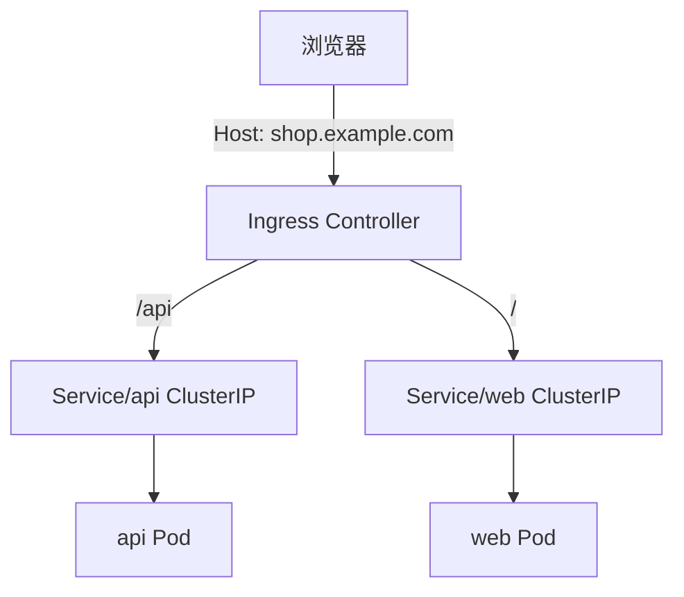

# K8s Service 与 Ingress（小白内化版）

- 维：C1｜题：R1-Q04 / R1-Q11｜状态：一面不会→补洞中

## 1. 为什么需要 Service？

Pod IP **会变**（重建就换）。业务不能写死 `10.0.1.23:8080`。  
Service 提供：

1. **稳定虚拟入口**（ClusterIP 或对外暴露方式）  
2. **用 label 找到当前该接流量的 Pod**（Endpoints）  
3. **转发**（kube-proxy 等）

---

## 2. 总览图



记法：**外面怎么进门可以变，进门后几乎都要落到某个 Service，再转到 Pod。**

---

## 3. 三种 Service：包怎么走（案例）

### 案例 A：集群内调用（东西向）——ClusterIP

场景：支付 Pod 调订单 API。

```text
支付 Pod
  → 解析订单 Service DNS：orders.default.svc.cluster.local
  → 得到 ClusterIP（如 10.96.10.20）
  → 发到 10.96.10.20:80
  → 节点上的转发规则把包转到某个订单 Pod:8080
```



**内化点：** ClusterIP **不是**某台机器网卡上的普通 IP，而是集群里的**虚拟服务地址**；真正收包的是 Pod。

---

### 案例 B：临时从笔记本访问——NodePort

场景：本地 `curl http://节点公网IP:30080`。

```text
你的电脑
  → 节点 IP:30080（每台节点都开了这个端口）
  → 转到对应 Service
  → 再转到某 Pod
```


**内化点：**  
- 方便调试，生产少当主入口（端口范围有限、要暴露节点、不好看）  
- 打到**任意**节点的 NodePort，一般都能进（规则在各节点）

---

### 案例 C：云上正式对外 TCP——LoadBalancer

场景：云厂商分配 `203.0.113.10`。

```text
公网用户 → 云 LB VIP → 后端挂节点 NodePort 或直接到 Pod
         → Service → Pod
```

**内化点：** LoadBalancer 类型 =「请云帮我建一个 LB，并接到这个 Service」。没云环境常会 Pending。

---

### 案例 D：网站按域名进——Ingress + ClusterIP

场景：`https://shop.example.com/api` → API；`/` → 前端。



**内化点：**  
- Ingress **对象**只是规则；必须有 **Ingress Controller** 在跑  
- Ingress 后面通常是 **ClusterIP Service**，不是直接替代 Service  
- TLS 证书常挂在 Ingress 这层终止

---

## 4. 内部关键细节（面试够用，不背源码）

### 4.1 Endpoints / EndpointSlice

Service 用 selector 选中 Pod 后，控制面会维护「当前可转发的地址列表」。

```text
Service selector: app=orders
  → 匹配到的 Pod IP:端口 写入 Endpoints
  → 没有匹配 / Pod 未 Ready → Endpoints 为空 → 表现为「Service 不通」
```

**排查第一反应：** `kubectl get endpoints <svc>` 有没有地址（链 R1-Q11）。

### 4.2 kube-proxy：iptables vs ipvs（对比点到）

| | iptables | ipvs |
|--|----------|------|
| 直觉 | 一堆 iptables 规则做 DNAT | 内核负载均衡 |
| 规模 | Service/Pod 很多时规则更新重 | 大规模常更稳 |
| 面试 | 知道「节点上有转发规则」即可 | 知道「另一种模式」即可 |

### 4.3 readiness 和「进不进 Service」

Pod Running 但 **readiness 失败** → 通常 **不会进 Endpoints** → Service 不会把流量打给它。  
对比：liveness 失败会重启；readiness 失败只摘流量（链 R1-Q07）。

---

## 5. 选型速查（内化成肌肉）

| 需求 | 选什么 |
|------|--------|
| 集群内服务互调 | ClusterIP |
| 临时从外网调试 | NodePort |
| 云上对外 TCP/简单一端口 | LoadBalancer |
| 对外 HTTP 多域名/多路径 | Ingress → 多个 ClusterIP |
| 东西向要加密/网格 | 另议 Mesh（L3 点到边界即可） |

---

## 6. 动手脑补（不用真集群也能想）

1. 订单 Pod 扩了 3 个副本：ClusterIP 不变，Endpoints 变多，转发在副本间分担。  
2. 删光所有订单 Pod：ClusterIP 还在，Endpoints 空，调用失败——**问题在后端不是「Service 没了」**。  
3. 只有 Ingress 没装 Controller：域名永远进不来。  

---

## 7. 30 秒背板 + 自测

背板：ClusterIP 内；NodePort 节点端口；LB 云负载均衡；Ingress HTTP 路由且后端仍是 Service。

自测：
1. 画「浏览器 → Ingress → Service → Pod」  
2. 支付调订单为什么一般不走 Ingress？  
3. Endpoints 为空时你先怀疑什么？
