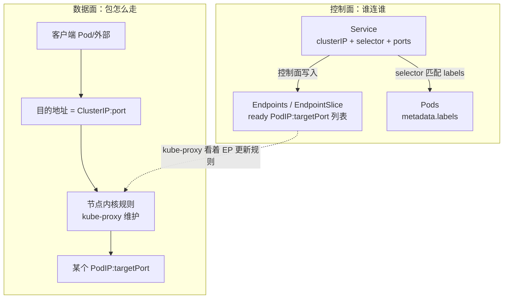
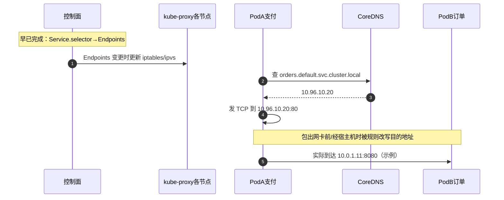
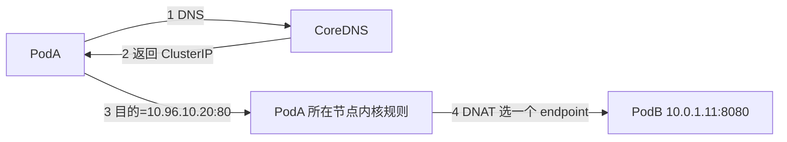
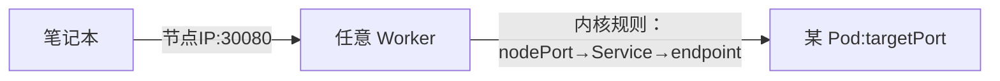
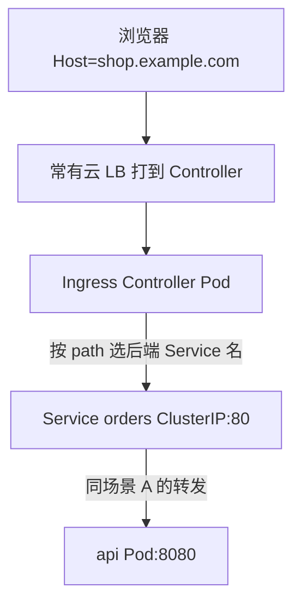

# K8s Service / Ingress（机制 + 关键旋钮版）

- 维：C1｜题：R1-Q04 / R1-Q11｜状态：一面不会→补洞中（重写：包路径 + 关键字段）

> 面试要能说清两件事：  
> 1）**控制面**怎么把 Service 绑到 Pod 列表；  
> 2）**数据面**一个包从谁发到谁（不经过 Ingress 的路径也要会画）。

---

## 0. 先纠正三个常见错觉

| 错觉 | 正解 |
|------|------|
| 「要先访问 kube-proxy 进程，再去 ClusterIP」 | kube-proxy 多半是**改节点上的转发规则**（iptables/ipvs）。请求包**不**先 HTTP 进 kube-proxy 再转发；包直接对着 ClusterIP 发出去，**内核规则**改目的地址到 Pod IP |
| 「集群内互调也要走 Ingress」 | **不要。** 东西向：DNS/ClusterIP →（节点转发）→ 对端 Pod。Ingress 是南北向 HTTP 入口 |
| 「ClusterIP 对应一个 label」 | 一对多：一个 Service（一个 ClusterIP）→ `selector` 匹配到的**一批** Pod → Endpoints 里一串 IP |

---

## 1. 对象关系（一张总图）



**对应关系（钉死）：**

```text
Service.name + namespace
  ├─ clusterIP（虚 IP，一个 Service 通常一个）
  ├─ ports[]：port（对外服务端口）→ targetPort（容器端口）
  ├─ selector：{ app: orders }     ←── 匹配 Pod.labels
  └─ 派生出 Endpoints：
        [10.0.1.11:8080, 10.0.1.12:8080, ...]   ←── 当前 Ready 的后端
```

不是「ClusterIP ↔ 单个 label」，而是：

**ClusterIP(+port) ↔ Endpoints 集合**；Endpoints 由 **selector↔labels** 算出来。

---

## 2. 关键旋钮（YAML 里真正要盯的字段）

### 2.1 Service（最重要）

```yaml
apiVersion: v1
kind: Service
metadata:
  name: orders
  namespace: default
spec:
  type: ClusterIP          # 旋钮1：ClusterIP | NodePort | LoadBalancer
  clusterIP: 10.96.10.20   # 旋钮2：通常系统分配；虚 IP，不是某网卡 IP
  selector:                # 旋钮3：选哪些 Pod
    app: orders
  ports:                   # 旋钮4：端口映射
    - name: http
      port: 80             # 客户端连 Service 时用的端口
      targetPort: 8080     # 真正打到容器的端口（可以是名字）
      # nodePort: 30080    # 仅 NodePort/LB 时出现（30000–32767）
```

| 旋钮 | 含义 | 排障时 |
|------|------|--------|
| `type` | 暴露方式 | 外网不通先看是不是只建了 ClusterIP |
| `clusterIP` | 稳定虚 IP | DNS 解析结果通常就是它 |
| `selector` | 选 Pod | 和 Deployment 的 `template.labels` 必须对上 |
| `port` | 服务端口 | curl 的是这个端口，不是随便猜 |
| `targetPort` | 容器端口 | 和容器 `containerPort`/实际监听一致 |
| `nodePort` | 节点端口 | NodePort/LB 对外时用 |

配套查：

```bash
kubectl get svc orders -o wide
kubectl get endpoints orders          # 或 endpointslice
kubectl get pods -l app=orders -o wide
```

### 2.2 Pod 侧要对上的旋钮

```yaml
metadata:
  labels:
    app: orders          # 必须被 Service.selector 命中
spec:
  containers:
    - ports:
        - containerPort: 8080
  readinessProbe: ...    # 失败 → 通常不进 Endpoints → Service 不给它流量
```

### 2.3 Ingress（规则对象，不是转发器本体）

```yaml
apiVersion: networking.k8s.io/v1
kind: Ingress
metadata:
  name: shop
spec:
  ingressClassName: nginx     # 旋钮：哪个 Controller 认这笔规则
  tls:
    - hosts: [shop.example.com]
      secretName: shop-tls    # TLS 常在这里终止
  rules:
    - host: shop.example.com  # 旋钮：域名
      http:
        paths:
          - path: /api        # 旋钮：路径
            pathType: Prefix
            backend:
              service:
                name: orders  # 旋钮：后端仍是 Service 名
                port:
                  number: 80
```

**Ingress YAML 自己不转发包**；集群里要有 **Ingress Controller Pod**（如 nginx-ingress）在跑，它读规则、听 80/443，再去连后端 Service。

---

## 3. ClusterIP：是不是真 IP？为啥还用域名？

### 3.1 ClusterIP 是真的「IP 地址」吗？

- **是**：它是集群 `service-cluster-ip-range` 里分配出来的一个 **IP 地址**（如 `10.96.10.20`）。
- **但不是**：某台机器网卡上配好的普通主机 IP。  
  没有一块网卡「拥有」这个地址；靠各节点上的 **DNAT/IPVS 规则** 把「打到这个 VIP 的包」改写成「打到某个 Pod IP」。

所以口述可以说：**「虚拟服务 IP（VIP），集群内可路由到，由 kube-proxy 规则落地。」**

### 3.2 为啥业务常用域名而不是写死 ClusterIP？

| | DNS 名 | 直接写 ClusterIP |
|--|--------|------------------|
| 例子 | `orders.default.svc.cluster.local` | `10.96.10.20` |
| 优点 | 好记；换 Service 重建后名可不变 | 少一次解析 |
| 缺点 | 多一步解析 | IP 可能变（删建 Service）；难读 |

**调用时：** 域名 **解析成** ClusterIP，然后包的目的 IP 仍是 ClusterIP。  
域名不是另一条转发通道，只是 **名字 → ClusterIP** 的电话簿。

---

## 4. 场景 A：Service A 里的 Pod 调 Service B（东西向）——逐步拆包

设定：

- PodA（支付）要调 orders  
- Service `orders`：`clusterIP=10.96.10.20`，`port=80` → `targetPort=8080`  
- 后端 PodB1/PodB2：`10.0.1.11:8080`、`10.0.1.12:8080`

### 4.1 要不要走 Ingress？要不要「先去 kube-proxy 再去 ClusterIP」？

```text
❌ PodA → Ingress → Service B
❌ PodA → kube-proxy 进程 → ClusterIP → PodB
✅ PodA →（DNS 得到 ClusterIP）→ 发往 ClusterIP:80
     → 本节点内核规则（kube-proxy 维护）DNAT
     → PodB_IP:8080
```

### 4.2 时序图（控制面 vs 数据面分开）



### 4.3 流程图（只画数据面）



**你要会说的一句：**  
「客户端以为自己连的是 Service IP；节点规则在转发时把目的地址换成某个 Ready Pod IP。Endpoints 就是候选名单。」

---

## 5. 场景 B：NodePort（外网/调试入口）



关键旋钮：`type=NodePort` + `ports.nodePort`（或自动分配）。  
每台节点都开同一 `nodePort`；打到**任意**节点一般都能进。

---

## 6. 场景 C：LoadBalancer（云上对外）


关键旋钮：`type=LoadBalancer`；看 `status.loadBalancer.ingress` 是否已有外部 IP。  
没云控制器 → 常一直 **Pending**。  
很多实现 = **云 LB + 后面仍是 NodePort/节点转发**（口述点到即可）。

---

## 7. 场景 D：Ingress（HTTP 南北向）



对比：

| 路径 | 是否经 Ingress |
|------|----------------|
| 浏览器打开网站 | 通常要（或等价网关） |
| 集群内支付→订单 | **不要** |

---

## 8. 「连接」到底怎么连上的？（selector → Endpoints → 规则）

分三步，面试按这个说：

```text
① 声明关系（Service）
   selector: app=orders
   port 80 → targetPort 8080
   分配 clusterIP

② 算出名单（Endpoints/EndpointSlice）
   列出 labels 匹配且 Ready 的 PodIP:8080
   名单空 = Service「悬空」= 常见不通原因

③ 装上管道（kube-proxy）
   每个节点：看到「有人访问 clusterIP:80」
   → 从名单里挑一个 → DNAT 到 PodIP:8080
```

扩缩容时：ClusterIP **不变**；变的是 Endpoints 名单和节点规则。

---

## 9. 选型肌肉（带误用代价）

| 需求 | 选 | 为什么不选另一个 |
|------|----|------------------|
| Pod→Pod 业务调用 | ClusterIP + DNS | 走 Ingress 多一跳、还绑 HTTP |
| 临时 curl 验证 | NodePort | 生产当主入口难管理、端口丑 |
| 云上对外 TCP/单端口 | LoadBalancer | 纯 ClusterIP 外网进不来 |
| 多域名/多路径 HTTPS | Ingress→多个 ClusterIP | 每个域名一个 LB 又贵又散 |

---

## 10. 30 秒背板

- ClusterIP = 集群内 VIP；域名解析到它；转发靠节点规则，不靠「先访问 kube-proxy HTTP」。  
- selector→Endpoints 名单；规则按名单 DNAT 到 Pod。  
- NodePort/LB/Ingress 是**怎么从外进来**；进来后多数仍落到 Service→Pod。  
- 东西向不走 Ingress。

自测（闭卷画图）：
1. 画出 PodA→ServiceB→PodB 四步（DNS / VIP / 规则 / PodIP）  
2. 标出 selector、Endpoints、port/targetPort 各在哪一步用到  
3. 同一调用为什么不经 Ingress？
